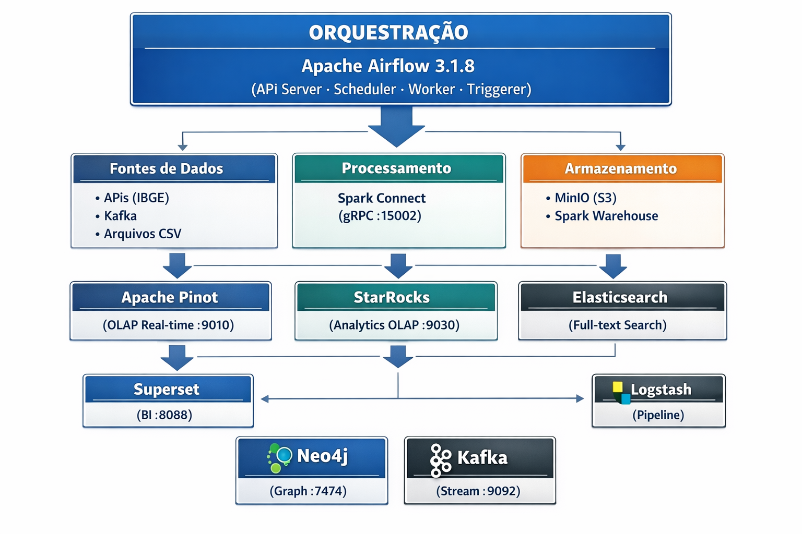
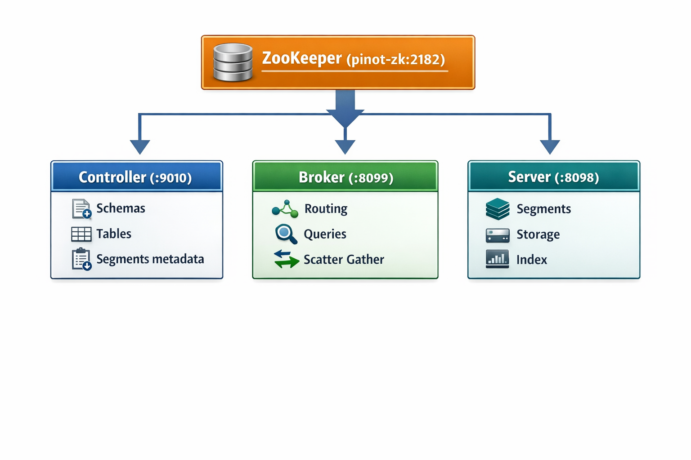
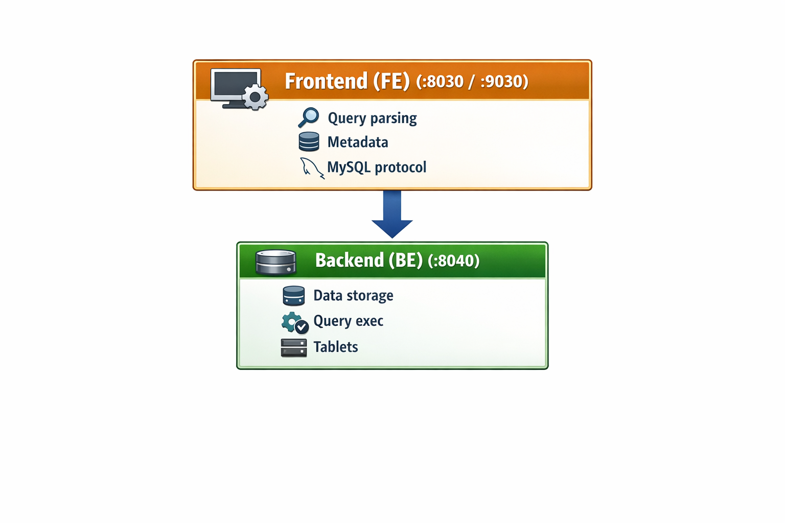

# Engenharia de Dados Moderna: Construindo uma Plataforma OLAP em Tempo Real com Airflow 3, Spark Connect e Apache Pinot

## Introdução

No cenário atual de Big Data, a capacidade de transformar dados brutos em insights acionáveis em questão de milissegundos tornou-se um diferencial competitivo crítico. Este projeto apresenta uma arquitetura de referência para uma plataforma de dados moderna, integrando orquestração de ponta, processamento distribuído e motores OLAP (Online Analytical Processing) de ultra-baixa latência.

O objetivo principal é demonstrar como orquestrar fluxos complexos de dados — desde a ingestão via API até a disponibilização para dashboards de BI — utilizando as ferramentas mais robustas do ecossistema open-source, tudo rodando localmente com Docker Compose e reproduzível via Dev Container.

---

## A Arquitetura da Plataforma

A plataforma foi desenhada seguindo princípios de desacoplamento e escalabilidade. Cada componente desempenha um papel específico no ciclo de vida do dado:



### Os Pilares

1. **Orquestração (Apache Airflow 3.1.8)**: O cérebro da operação. Responsável por agendar, monitorar e garantir a execução de pipelines (DAGs). A versão 3.x traz melhorias significativas em performance, uma nova UI moderna e suporte nativo a execuções mais rápidas.
2. **Processamento (Apache Spark 4.0.1 com Spark Connect)**: O Spark Connect introduz uma arquitetura cliente-servidor para o Spark. Isso permite que o Airflow (atuando como cliente) envie comandos de transformação para um cluster Spark remoto via gRPC, sem a necessidade de manter uma JVM pesada localmente, simplificando drasticamente os Workers do Airflow.
3. **Real-Time OLAP (Apache Pinot)**: O coração da plataforma para consultas de baixa latência. O Pinot é otimizado para responder perguntas complexas sobre volumes massivos de dados em milissegundos.
4. **Analytics OLAP (StarRocks)**: Um motor SQL ultra-rápido que complementa o Pinot, ideal para JOINs complexos e consultas de larga escala, mantendo a compatibilidade com o protocolo MySQL.
5. **Object Storage (MinIO)**: Atua como o Data Lake compatível com S3, servindo de base para o armazenamento de arquivos Parquet e checkpoints do Spark.
6. **Streaming (Apache Kafka + Schema Registry)**: Backbone de eventos em tempo real, com governança de schemas via Confluent Schema Registry.
7. **Busca e Observabilidade (Elasticsearch + Logstash)**: Motor de busca full-text e pipeline de ingestão de logs para observabilidade da plataforma.
8. **Grafos (Neo4j)**: Banco de dados de grafos para modelagem de relacionamentos complexos entre entidades.

---

## O Papel Vital do Apache Pinot

### Por que o Apache Pinot é Revolucionário?

O **Apache Pinot** não é apenas mais um banco de dados; ele é um motor de **User-Facing Analytics**. Enquanto Data Warehouses como Snowflake ou BigQuery são excelentes para analistas internos, o Pinot é desenhado para servir milhares de usuários finais simultâneos com latência sub-segundo.

*   **Indexação de Próxima Geração**: O Pinot brilha com seus índices especializados:
    *   **Inverted Index**: Para buscas rápidas em colunas com muitos valores repetidos.
    *   **Star-tree Index**: Pré-agrega dados de forma inteligente, permitindo que somas e médias em bilhões de linhas sejam instantâneas.
    *   **JSON Index**: Permite consultar campos dentro de estruturas JSON complexas sem perda de performance.
*   **Arquitetura Híbrida**: Ele permite combinar dados históricos (vindos do S3/MinIO via Batch) com dados em tempo real (vindos do Kafka) em uma única tabela lógica.
*   **Baixa Latência de Ingestão**: Os dados ficam disponíveis para consulta milissegundos após serem produzidos no Kafka.

### Arquitetura Interna do Pinot

O Pinot roda com 4 componentes, cada um em seu próprio container:



- **ZooKeeper** — Coordenação e service discovery (porta 2182, separado do ZK do Kafka para evitar conflitos)
- **Controller** — Gerencia schemas, tabelas e metadados de segmentos. Expõe a UI web e a API REST de ingestão
- **Broker** — Recebe queries SQL, roteia para os servers corretos e agrega resultados (scatter-gather)
- **Server** — Armazena os segmentos de dados e executa o processamento local

### Pinot vs. StarRocks: Quando Usar Cada Um?

| Critério | Apache Pinot | StarRocks |
|---|---|---|
| **Latência** | Sub-milissegundo (p99) | Milissegundos a segundos |
| **Caso de uso** | User-facing analytics, dashboards em tempo real | Analytics interno, JOINs complexos, ad-hoc |
| **Ingestão** | Batch (OFFLINE) + Streaming (REALTIME) | Batch via INSERT/JDBC |
| **JOINs** | Limitados (lookup joins) | Completos (star schema, snowflake) |
| **Protocolo** | REST API + SQL via Broker | MySQL protocol (porta 9030) |
| **Escalabilidade** | Horizontal (adicionar servers) | Horizontal (adicionar backends) |

Em nosso projeto, usamos **ambos**: o Pinot para servir consultas de baixa latência (simulando um portal público) e o StarRocks para analytics mais complexos via SQL padrão.

---

## Mergulho Técnico: O Pipeline IBGE → Spark → Pinot + StarRocks

A DAG `ibge_pinot_starrocks.py` exemplifica o estado da arte em pipelines de dados, com 6 tasks orquestradas em paralelo:

```
extract_ibge ──→ transform_spark ──┬──→ setup_pinot_table ──→ load_pinot
                                   │
                                   └──→ setup_starrocks ──→ load_starrocks
```

### 1. Extração Inteligente (`extract_ibge`)

Utilizamos a API de [Aglomerações Urbanas do IBGE](https://servicodados.ibge.gov.br/api/v1/localidades/aglomeracoes-urbanas). O dado chega em um JSON profundamente aninhado — municípios dentro de aglomerações, com UF e região como sub-objetos:

```json
{
  "id": "00301",
  "nome": "Aglomeração Urbana de Franca",
  "municipios": [
    {
      "id": 3503000,
      "nome": "Aramina",
      "UF": {
        "id": 35,
        "sigla": "SP",
        "nome": "São Paulo",
        "regiao": { "id": 3, "sigla": "SE", "nome": "Sudeste" }
      }
    }
  ]
}
```

### 2. Transformação com Spark Connect 4 (`transform_spark`)

O Spark Connect é o grande diferencial arquitetural. O Airflow Worker atua como um **cliente leve** que envia comandos via gRPC para o cluster Spark, sem carregar uma JVM local:

```python
# Conexão remota via gRPC — sem JVM no Worker do Airflow
spark = SparkSession.builder.remote("sc://spark-connect:15002").getOrCreate()

# Schema explícito para o JSON aninhado
schema = StructType([
    StructField("id", StringType()),
    StructField("nome", StringType()),
    StructField("municipios", ArrayType(StructType([
        StructField("id", IntegerType()),
        StructField("nome", StringType()),
        StructField("UF", StructType([
            StructField("id", IntegerType()),
            StructField("sigla", StringType()),
            StructField("nome", StringType()),
            StructField("regiao", StructType([
                StructField("id", IntegerType()),
                StructField("sigla", StringType()),
                StructField("nome", StringType()),
            ])),
        ])),
    ]))),
])

# Explode + flatten: transforma hierarquia aninhada em colunas planas
flat = (
    df.select("id", "nome", F.explode("municipios").alias("m"))
    .select(
        F.col("id").alias("aglomeracao_id"),
        F.col("nome").alias("aglomeracao_nome"),
        F.col("m.id").alias("municipio_id"),
        F.col("m.nome").alias("municipio_nome"),
        F.col("m.UF.id").alias("uf_id"),
        F.col("m.UF.sigla").alias("uf_sigla"),
        F.col("m.UF.nome").alias("uf_nome"),
        F.col("m.UF.regiao.id").alias("regiao_id"),
        F.col("m.UF.regiao.sigla").alias("regiao_sigla"),
        F.col("m.UF.regiao.nome").alias("regiao_nome"),
    )
)
```

O resultado é uma tabela plana com 10 colunas, pronta para ingestão em qualquer motor OLAP:

| Coluna | Tipo | Origem |
|---|---|---|
| `aglomeracao_id` | STRING | `id` da aglomeração |
| `aglomeracao_nome` | STRING | `nome` da aglomeração |
| `municipio_id` | INT | `municipios[].id` |
| `municipio_nome` | STRING | `municipios[].nome` |
| `uf_id` | INT | `municipios[].UF.id` |
| `uf_sigla` | STRING | `municipios[].UF.sigla` |
| `uf_nome` | STRING | `municipios[].UF.nome` |
| `regiao_id` | INT | `municipios[].UF.regiao.id` |
| `regiao_sigla` | STRING | `municipios[].UF.regiao.sigla` |
| `regiao_nome` | STRING | `municipios[].UF.regiao.nome` |

### 3. Automação de Schema e Ingestão no Pinot (`setup_pinot_table` + `load_pinot`)

O pipeline gerencia a infraestrutura automaticamente. Primeiro, cria o schema e a tabela OFFLINE via API REST do Controller:

```json
{
  "schemaName": "ibge_aglomeracoes",
  "dimensionFieldSpecs": [
    {"name": "aglomeracao_id", "dataType": "STRING"},
    {"name": "aglomeracao_nome", "dataType": "STRING"},
    {"name": "municipio_id", "dataType": "INT"},
    {"name": "municipio_nome", "dataType": "STRING"},
    {"name": "uf_id", "dataType": "INT"},
    {"name": "uf_sigla", "dataType": "STRING"},
    {"name": "uf_nome", "dataType": "STRING"},
    {"name": "regiao_id", "dataType": "INT"},
    {"name": "regiao_sigla", "dataType": "STRING"},
    {"name": "regiao_nome", "dataType": "STRING"}
  ]
}
```

A ingestão usa o endpoint `/ingestFromFile` do Controller com **multipart file upload** em formato NDJSON (Newline Delimited JSON). Este detalhe é crucial — o Pinot não aceita body JSON direto neste endpoint:

```python
ndjson = "\n".join(json.dumps(row, ensure_ascii=False) for row in rows)

requests.post(
    f"{PINOT_CONTROLLER}/ingestFromFile",
    params={
        "tableNameWithType": "ibge_aglomeracoes_OFFLINE",
        "batchConfigMapStr": json.dumps({
            "inputFormat": "json",
            "recordReader.className": "org.apache.pinot.plugin.inputformat.json.JSONRecordReader",
        }),
    },
    # IMPORTANTE: multipart file upload, não body direto
    files={"file": ("data.json", ndjson.encode("utf-8"), "application/json")},
)
```

### 4. Setup e Carga no StarRocks (`setup_starrocks` + `load_starrocks`)

O StarRocks apresenta um desafio de infraestrutura: o Backend (BE) demora ~30-60 segundos para se registrar no Frontend (FE) após o startup. A task `setup_starrocks` lida com isso usando `pymysql` com retry automático:

```python
@task(retries=10, retry_delay=timedelta(seconds=20))
def setup_starrocks():
    conn = pymysql.connect(host="starrocks-fe-0", port=9030, user="root",
                           cursorclass=pymysql.cursors.DictCursor)
    with conn.cursor() as cur:
        # Verifica se há backends disponíveis antes de criar a tabela
        cur.execute("SHOW BACKENDS")
        backends = cur.fetchall()
        alive = [b for b in backends if str(b.get("Alive", "")).lower() == "true"]
        if not alive:
            raise RuntimeError("Nenhum BE alive, aguardando...")

        cur.execute("CREATE DATABASE IF NOT EXISTS demo_ibge")
        cur.execute("""
            CREATE TABLE IF NOT EXISTS demo_ibge.ibge_aglomeracoes (...)
            DUPLICATE KEY(aglomeracao_id)
            DISTRIBUTED BY HASH(aglomeracao_id) BUCKETS 1
            PROPERTIES("replication_num" = "1")
        """)
```

Pontos importantes:
- **`pymysql` em vez de API HTTP**: A API HTTP do StarRocks não suporta DDL de forma confiável. O protocolo MySQL na porta 9030 é o método oficial
- **`BUCKETS 1` e `replication_num=1`**: Obrigatório em ambiente Docker com apenas 1 backend
- **`DictCursor`**: Permite acessar colunas pelo nome (`b.get("Alive")`) em vez de índice numérico, evitando bugs de parsing

A carga final usa Spark JDBC, aproveitando o driver MySQL já configurado no Spark Connect:

```python
df.write.format("jdbc") \
    .option("driver", "com.mysql.cj.jdbc.Driver") \
    .option("url", "jdbc:mysql://starrocks-fe-0:9030/demo_ibge") \
    .option("dbtable", "ibge_aglomeracoes") \
    .option("user", "root") \
    .mode("append").save()
```

---

## StarRocks: Arquitetura e Conexão

### Arquitetura



O FE recebe queries via protocolo MySQL e gerencia metadados. O BE armazena dados e executa queries. Um container auxiliar (`starrocks-add-be`) garante o registro do BE no FE via `ALTER SYSTEM ADD BACKEND`.

### Conectando ao StarRocks via IDEs

O StarRocks é 100% compatível com o **protocolo MySQL**. Qualquer ferramenta que conecte em MySQL funciona:

| Parâmetro | Valor |
|---|---|
| **Host** | `localhost` |
| **Porta** | `9030` |
| **Usuário** | `root` |
| **Senha** | *(vazio)* |
| **Database** | `demo_ibge` |
| **JDBC URL** | `jdbc:mysql://localhost:9030/demo_ibge` |

**DataGrip**: New Data Source → MySQL → preencha host/port/user → Test Connection

**DBeaver**: Nova Conexão → MySQL → preencha os dados → em Driver properties, defina `allowPublicKeyRetrieval=true`

**VS Code**: Extensão MySQL (`cweijan.vscode-mysql-client2`) → + → MySQL → preencha os dados

**Python**:
```python
import pymysql
conn = pymysql.connect(host="localhost", port=9030, user="root", password="")
with conn.cursor() as cur:
    cur.execute("SELECT regiao_nome, COUNT(*) FROM demo_ibge.ibge_aglomeracoes GROUP BY regiao_nome")
    for row in cur.fetchall():
        print(row)
```

**Superset** (dentro do Docker):
```
mysql+pymysql://root:@starrocks-fe-0:9030/demo_ibge
```

---

## Desenvolvimento com Dev Container

O projeto inclui configuração completa para **VS Code Dev Containers**, eliminando a necessidade de instalar qualquer dependência localmente.

```
F1 → Dev Containers: Reopen in Container
```

O Dev Container:
- Usa o `airflow-worker` como container principal
- Sobe **todos** os 20+ serviços automaticamente (incluindo Pinot, StarRocks, Kafka, etc.)
- Instala extensões Python, Ruff, Jupyter, Docker
- Configura o ambiente com `uv sync --locked && uv run pre-commit install`
- Workspace fica em `/opt/airflow/dags`

Isso significa que qualquer desenvolvedor pode clonar o repositório, abrir no VS Code e ter a plataforma inteira rodando em minutos.

---

## Tecnologias e Ecossistema

| Tecnologia | Versão | Função no Projeto | Por que escolhemos? |
|---|---|---|---|
| **Airflow** | 3.1.8 | Orquestrador | Padrão de mercado, agora mais rápido e extensível |
| **Spark** | 4.0.1 | Engine de Transformação | Spark Connect remove a barreira da JVM nos Workers |
| **Apache Pinot** | latest | Real-Time OLAP | Latência imbatível para consultas diretas |
| **StarRocks** | latest | Vectorized OLAP | Performance extrema para analytics complexo e JOINs |
| **Kafka** | 7.4.0 | Streaming | Backbone de eventos em tempo real |
| **Schema Registry** | 7.4.0 | Governança | Controle de schemas Avro/JSON |
| **MinIO** | latest | S3 Data Lake | Portabilidade e compatibilidade total com cloud |
| **Elasticsearch** | 8.11.0 | Busca full-text | Observabilidade e busca em logs |
| **Logstash** | 8.11.0 | Pipeline de logs | Ingestão estruturada de logs |
| **Neo4j** | 5.15.0 | Banco de grafos | Modelagem de relacionamentos complexos |
| **Superset** | latest | BI & Data Viz | Visualizações modernas e integração nativa com Pinot |
| **PostgreSQL** | 16 | Metastore | Backend do Airflow |
| **Redis** | 7.2 | Broker | Celery broker para execução distribuída |

---

## Lições Aprendidas e Desafios

### 1. Ingestão no Pinot: Multipart, não Body

O endpoint `/ingestFromFile` do Pinot Controller exige **multipart file upload** (`files=`). Enviar dados como body direto (`data=`) resulta em tabela criada mas sem registros — um erro silencioso difícil de diagnosticar.

### 2. StarRocks BE Registration: Paciência e Retry

O Backend do StarRocks demora ~30-60s para se registrar no Frontend após o startup. A solução foi:
- Healthcheck no FE (`/api/health`) para garantir que está pronto
- `sleep 15` no BE antes de iniciar o entrypoint
- Container auxiliar `starrocks-add-be` que executa `ALTER SYSTEM ADD BACKEND`
- Task com `retries=10` e `retry_delay=20s` que verifica `SHOW BACKENDS` antes do DDL

### 3. StarRocks DDL: MySQL Protocol, não HTTP API

A API HTTP do StarRocks (`/api/query`, `/api/v1/catalogs/.../sql`) aceita requisições mas não executa DDL de forma confiável. O protocolo MySQL na porta 9030 via `pymysql` é o único método garantido.

### 4. DictCursor para Parsing Seguro

O resultado de `SHOW BACKENDS` no StarRocks retorna muitas colunas. Usar índice numérico (`row[9]`) para acessar a coluna `Alive` é frágil — a posição pode mudar entre versões. `DictCursor` resolve isso acessando pelo nome da coluna.

### 5. Spark Connect: Simplicidade com Trade-offs

O Spark Connect simplifica enormemente a arquitetura (sem JVM no Worker), mas tem limitações: o `sessionInitStatement` do JDBC roda em conexões efêmeras que não persistem DDLs. A solução foi separar DDL (pymysql) de DML (Spark JDBC).

---

## Como Executar

### Docker Compose (desenvolvimento local)

```bash
# 1. Clone o repositório
git clone <repo-url>
cd airflow_pinot

# 2. Setup automático (cria diretórios, inicializa Airflow, sobe serviços)
chmod +x setup-airflow.sh
./setup-airflow.sh

# 3. Aguarde ~2-3 minutos e acesse:
#    Airflow:  http://localhost:8085 (airflow/airflow)
#    Pinot:    http://localhost:9010
#    Superset: http://localhost:8088 (admin/admin)

# 4. Ative e execute a DAG "ibge_pinot_starrocks" no Airflow

# 5. Consulte os dados:
#    Pinot:     SELECT * FROM ibge_aglomeracoes LIMIT 10
#    StarRocks: mysql -h 127.0.0.1 -P 9030 -u root -e "SELECT * FROM demo_ibge.ibge_aglomeracoes LIMIT 10"
```

### Kubernetes (produção / staging)

O projeto inclui manifests Kubernetes completos com **Kustomize**, organizados por componente:

```
k8s/
├── kustomization.yaml          # Ponto de entrada do Kustomize
├── deploy.sh                   # Script de deploy automatizado
└── base/
    ├── namespace.yaml          # Namespace + ConfigMap global
    ├── airflow/
    │   └── airflow.yaml        # Postgres, Redis, API Server, Scheduler, Worker, Triggerer, Init Job
    ├── pinot/
    │   └── pinot.yaml          # ZooKeeper, Controller, Broker, Server + PVCs
    ├── starrocks/
    │   └── starrocks.yaml      # Frontend, Backend, Add-BE Job + PVCs
    ├── kafka/
    │   └── kafka.yaml          # ZooKeeper, Kafka, Schema Registry
    ├── storage/
    │   └── storage.yaml        # MinIO + Spark Connect
    └── observability/
        └── observability.yaml  # Elasticsearch, Logstash, Neo4j, Superset
```

Cada serviço do Docker Compose tem seu equivalente em Kubernetes: Deployments com readiness probes, Services (ClusterIP + NodePort para UIs), PersistentVolumeClaims para dados persistentes e Jobs para inicialização (Airflow DB migrate, StarRocks BE registration).

#### Deploy rápido

```bash
# Via script automatizado
cd k8s && bash deploy.sh

# Ou via Makefile
make k8s-deploy

# Ou manualmente via Kustomize
kubectl apply -k k8s/
```

#### Acessos via NodePort

| Serviço | NodePort | URL |
|---|---|---|
| Airflow UI | 30085 | http://localhost:30085 |
| Pinot UI | 30010 | http://localhost:30010 |
| StarRocks MySQL | 30930 | `mysql -h localhost -P 30930 -u root` |
| MinIO Console | 30901 | http://localhost:30901 |
| Superset | 30088 | http://localhost:30088 |

#### Acessos via port-forward (alternativa)

```bash
# Airflow
kubectl port-forward svc/airflow-apiserver 8085:8080 -n airflow-datalake

# Pinot
kubectl port-forward svc/pinot-controller 9010:9000 -n airflow-datalake

# StarRocks
kubectl port-forward svc/starrocks-fe 9030:9030 -n airflow-datalake
```

#### Comandos úteis

```bash
# Status dos pods
make k8s-status

# Logs do Airflow
make k8s-logs

# Remover tudo
make k8s-delete
```

#### Docker Compose vs. Kubernetes

| Aspecto | Docker Compose | Kubernetes |
|---|---|---|
| **Uso** | Desenvolvimento local, Dev Container | Staging, produção |
| **Escala** | Fixa (1 réplica) | Escalável (HPA, réplicas) |
| **Persistência** | Volumes Docker | PersistentVolumeClaims |
| **Rede** | Bridge network | ClusterIP + NodePort/Ingress |
| **Health checks** | `healthcheck:` | `readinessProbe:` / `livenessProbe:` |
| **Init tasks** | `depends_on: condition` | Jobs + init containers |
| **Deploy** | `make up` | `kubectl apply -k k8s/` |

---

## Conclusão

Construir uma plataforma que une a robustez do **Airflow 3** com a agilidade do **Apache Pinot** e do **Spark Connect** prepara qualquer arquiteto de dados para os desafios modernos de escala e tempo real.

O Apache Pinot se destaca como a peça central para **user-facing analytics** — cenários onde milhares de usuários precisam de respostas instantâneas sobre dados que podem estar sendo ingeridos naquele exato momento. Combinado com o StarRocks para analytics mais complexos, temos uma plataforma que cobre desde dashboards operacionais até análises exploratórias profundas.

As lições aprendidas durante a construção — desde os detalhes de multipart upload no Pinot até o timing de registro do StarRocks BE — são o tipo de conhecimento prático que só se adquire colocando a mão na massa. Este projeto serve como um laboratório completo para explorar essas tecnologias sem a complexidade de configurar cada uma manualmente, graças ao poder do Docker Compose e do Dev Container.

O futuro da engenharia de dados é desacoplado, assíncrono e, acima de tudo, **instantâneo**.

---

## Referências

- [Apache Pinot Architecture Explained for Data Engineers](https://medium.com/towards-data-engineering/apache-pinot-architecture-explained-for-data-engineers-2bd971ed4a4c) — Towards Data Engineering (Medium)
- [Apache Pinot — Documentação Oficial](https://docs.pinot.apache.org/)
- [Apache Airflow — Documentação Oficial](https://airflow.apache.org/docs/)
- [Spark Connect — Overview](https://spark.apache.org/docs/latest/spark-connect-overview.html)
- [StarRocks — Documentação Oficial](https://docs.starrocks.io/)
- [API IBGE — Localidades](https://servicodados.ibge.gov.br/api/docs/localidades)
